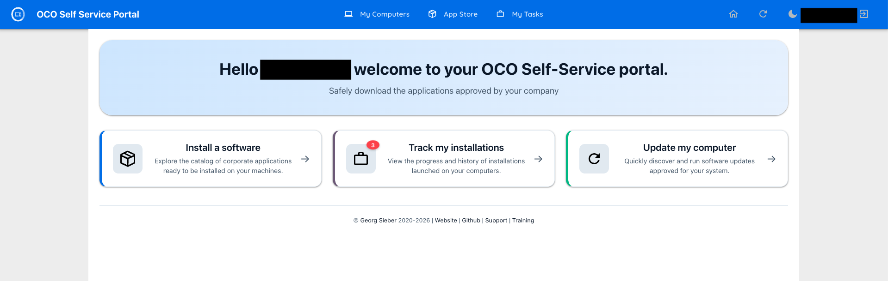
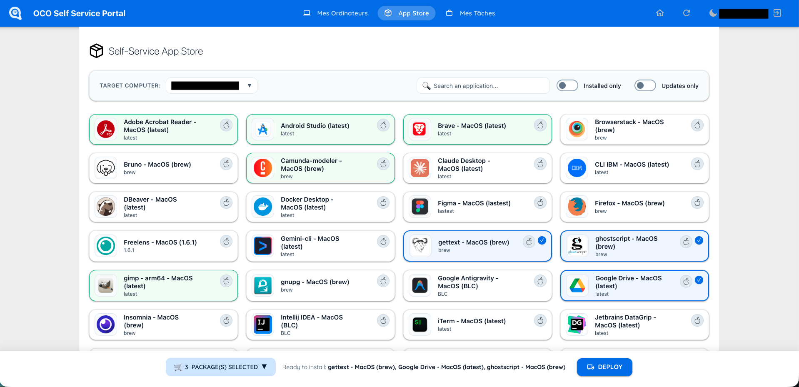

# OCO Self-Service Portal Redesign

An enhanced UI extension for the [OCO-Server](https://github.com/schorschii/OCO-Server) self-service user portal.

## Overview

This extension provides a modern and streamlined interface for the default OCO user portal. It simplifies navigation, enabling users to:
- Browse available software packages at a glance.
- Select and install multiple packages in just a few clicks.
- Track ongoing installation progress on their machines.

## Screenshots

| Main Dashboard | Package Details |
| :---: | :---: |
|  |  |

## Installation

1. **Navigate to the OCO extensions directory on your server:**
   ```bash
   cd /var/www/oco/extensions/
   ```
2. **Clone this repository:**

```Bash
git clone https://github.com/POLYANKA123456/oco-portal-redesign
```

3. **Configure routing rules:**
Edit /var/www/oco/self-service/views/.htaccess and add the following line at the very top of the file:

```Apache
RewriteRule ^(homepage|computers|packages|job-containers|job-container-new)\.php$ index.php [L]
```
